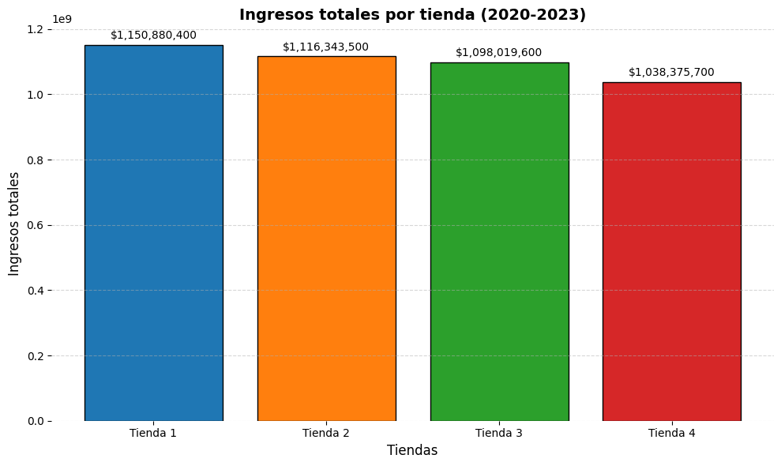
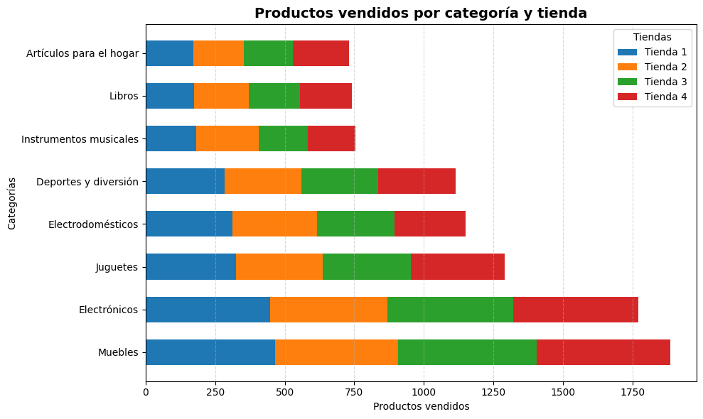
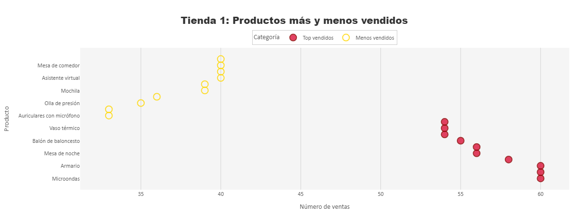
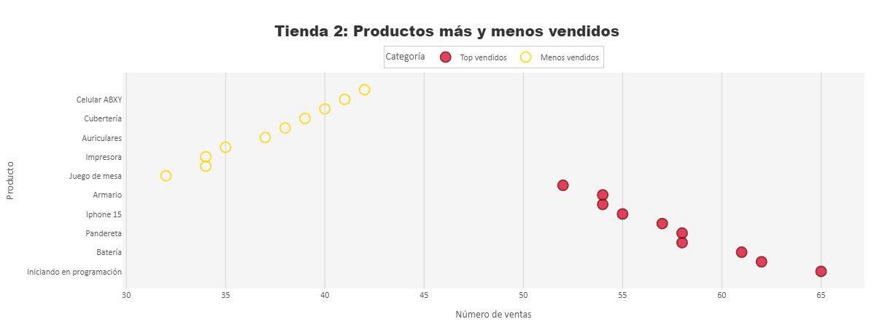
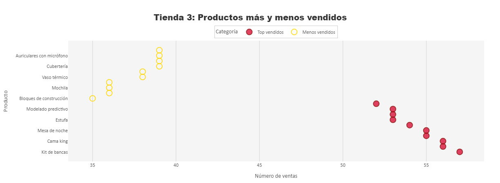
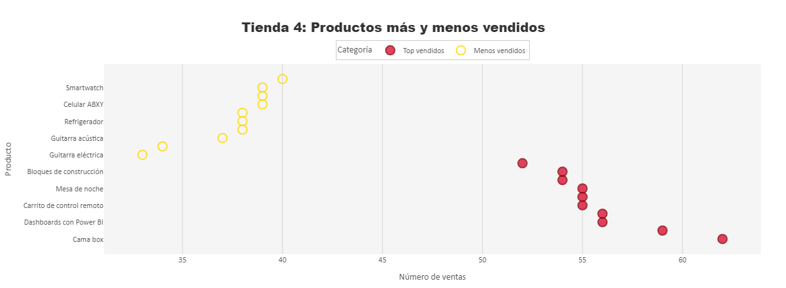
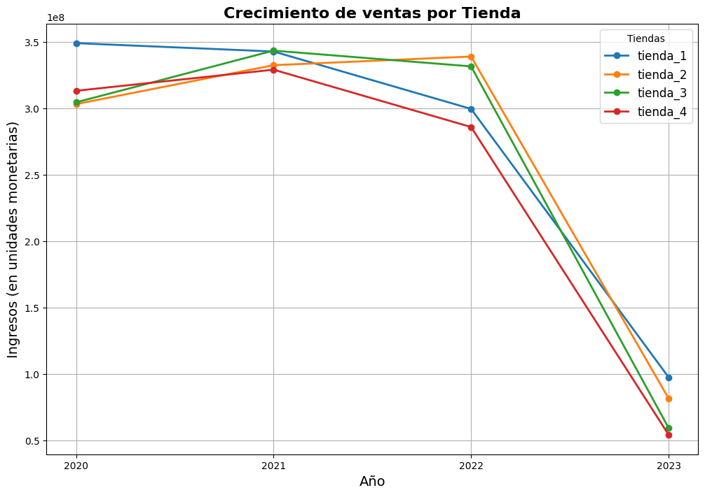

##  Análisis Exploratorio de Datos

Como paso inicial se confirmó que los cuatro conjuntos de datos reúnen las condiciones mínimas de calidad para su procesamiento. En particular:

- **Integridad de la información:** no se detectaron valores faltantes ni registros duplicados.  
- **Consistencia de formato y topología:** las columnas presentan el mismo esquema y carecen de inconsistencias (por ejemplo, números almacenados como texto o fechas mal formateadas).  
- **Tipos de datos apropiados:** cada variable (numérica, categórica, fecha) está declarada con el tipo correcto, lo que garantiza operaciones y transformaciones sin errores.  
- **Estandarización estructural:** todos los archivos comparten la misma disposición de columnas, lo que facilita la unificación y el análisis conjunto.

### Estructura de los datos

- **Producto y Categoría:** artículos vendidos y su clasificación en categorías.  
- **Precio y Envío:** valor de venta de cada producto y costos asociados de transporte.  
- **Fecha y ubicación de compra:** marca temporal de la transacción y ciudad o región de origen.  
- **Evaluación de compra:** calificaciones y comentarios proporcionados por los clientes.  
- **Tipo de Pago y Cuotas:** método de pago utilizado y número de cuotas seleccionadas.  
- **Coordenadas Geográficas:** latitud y longitud donde se realizó cada transacción.

---
# Principales hallazgos del analisis 

## **Ingresos Totales**: 
Los ingresos totales por cada tienda en el periodo de 2020-01-31 al 2023-03-31 fueron
   - **Tienda 1: $1,150,880,400.00**
   - **Tienda 2: $1,116,343,500.00**
   - **Tienda 3: $1,098,019,600.00**
   - **Tienda 4: $1,038,375,700.00**

La Tienda 1 es la que ha generado más ingresos totales en el periodo de tres años. Sin embargo, su rendimiento no necesariamente la hace la opción más eficiente si se considera la relación entre ingresos, costos y satisfacción del cliente. En contraste, Tienda 4, aunque tiene ingresos totales más bajos, muestra una eficiencia en la distribución y en costos.

## **Categorías más Vendidas**: 
 La cadena de sucursales ofrece una variedad de productos, los cuales  están agrupados por las siguientes  categorías:  Artículos para el hogar, Deportes y diversión, Electrodomésticos, Electrónicos, Intrumentos musicales,  Juguetes, Libros y Muebles.
 Las  tres categorías con más ventas  en todas las tiendas fueron Muebles, Eectrónicos y Juguetes. A acontinuación se presentan el número de ventos y los ingresos:

   - **Tienda 1:**
      - **Muebles**, con un total de 465 de productos vendidos e ingresos de $187,633,700.
      - **Electrónicos**, con un total de 448 productos vendidos e ingresos de $429,493,500.
      - **Jueguetes**, con un total de 324 productos vendidos e ingresos de $17,995,700.

   - **Tienda 2:**  
      - **Muebles**, con un total de 442 de productos vendidos e ingresos de $176,426,300.
      - **Electrónicos**, con un total de 422 productos vendidos e ingresos de $410,831,100.
      - **Jueguetes**, con un total de 313 productos vendidos e ingresos de $15,945,400.

   - **Tienda 3:**  
      - **Muebles**, con un total de 499 de productos vendidos e ingresos de $201,072,100.
      - **Electrónicos**, con un total de 451 productos vendidos e ingresos de $410,775,800.
      - **Jueguetes**, con un total de 315 productos vendidos e ingresos de $19,401,100.

   - **Tienda 4:**  
      - **Muebles**, con un total de 480 de productos vendidos e ingresos de $192,528,900.
      - **Electrónicos**, con un total de 451 productos vendidos e ingresos de $409,476,100.
      - **Jueguetes**, con un total de 338 productos vendidos e ingresos de $20,262,200.

En los resultados se destaca que apaesar de ser a Tienda 1 es la que más ingresos ha tenido en el perido de tres años, la Tienda 4 es quién más ingresos tiene en cada una de las categorías más vendidas. También se destaca por tener un buen balance de ingresos a lo largo de las categorías, siendo consistente en la venta de Electrónica y Muebles. A pesar de tener menores ingresos totales, es una tienda eficiente en términos de ventas por categoría

## **Reseñas de Clientes**:  
Con el objetivo,  de conocer la satisfacción del cliente con los productos vendidos, se calculó de manera global las calificaciones  promedio de los clientes para cada tienda. Los resultados fueros los siguientes

   - La calificación promedio de los productos en la **Tienda 1** fue de: **3.98**
   - La calificación promedio de los productos en la **Tienda 2** fue de: **4.04**
   - La calificación promedio de los productos en la **Tienda 3** fue de: **4.05**
   - La calificación promedio de los productos en la **Tienda 4**  fue de: **4.00**

Las Tienda 2 y Tienda 3 tienen las mejores calificaciones promedio, lo que sugiere una mayor satisfacción del cliente. Tienda 1 tiene la calificación más baja (3.98), lo que podría indicar problemas de calidad o atención al cliente. Esto es una señal clara de que Tienda 1 tiene áreas de mejora en su servicio o producto.

## **Productos Más/Menos Vendidos** 
Dentro del análisis para identificar cuáles fueron los 10 productos más y menos vendidos en cada tienda, se encontraron los siguientes resultados:
   - **Más vendidos en  Tienda 1**
      1. Microondas - 60
      2. TV LED UHD 4K - 60
      3. Armario - 60
      4. Secadora de ropa - 58
      5. Mesa de noche -56
      6. Bloques de construcción  - 56
      7. Balón de baloncesto -55
      8. Bicicleta - 54
      9. vaso térmico -54
      10. Refrigerador
   - **Menos vendidos en Tienda 1**
      1. Auriculares con micrófono - 33
      2. Celular ABXY - 33
      3. Olla de presión - 35
      4. Pandereta - 36
      5. Mochila - 39
      6. Ciencia de datos con Python - 39
      7. Asistente visrtual - 40
      8. Muñeca bebé - 40
      9. Mesa de comedor - 40
      10. Dinosaurio Rex - 40 

 

**Fortalezas:**
La Tienda 1 destaca por productos de electrodomésticos como el microondas, TV LED UHD 4K, y muebles del hogar como el armario y la secadora de ropa. Es una tienda eficiente en la venta de electrónicos y artículos de hogar grandes.

**Debilidades:**
Sorprende que artículos tecnológicos pequeños (como auriculares con micrófono y el celular ABXY) y libros (Ciencia de datos con Python) sean los menos vendidos. Esto indica que el público objetivo posiblemente no está interesado en artículos tecnológicos pequeños o educativos.

   - **Más vendidos en Tienda 2**
      1. Iniciando en programación - 65
      2. Microondas - 62
      3. Batería - 61
      4. Guitarra acústica - 58
      5. Pandereta - 58
      6. Secadora de ropa -  57
      7. iphone - 15
      8. Bloques de construcción - 54
      9. Armario - 54
      10. Set de ollas - 52 

   - **Menos vendidos en Tienda 2**
      1. Juego de mesa -32
      2. Mesa comedor - 33
      3. Impresora -34
      4. Sillón - 35
      5. Auriculares -37
      6. Asistente Virtual - 38
      7. Smart TV - 40
      8. Celuar ABXY - 41
      9. Balón de baloncesto - 42

**Fortalezas:**
Esta tienda muestra una fortaleza significativa en productos culturales, educativos y musicales, encabezados por "Iniciando en programación", y seguida por productos como la guitarra acústica y la pandereta. El microondas y la batería también resaltan.

**Debilidades:**
Artículos de mobiliario, especialmente juegos de mesa, mesas de comedor y electrónica pequeña (impresora), son puntos débiles. Esta tienda posiblemente atrae más público juvenil o académico interesado en entretenimiento y formación educativa.

   - **Más vendidos en Tienda 3**
      1. Kit de bancas - 57
      2. Mesa de comedor - 56
      3. Cama king - 56
      4. Set de ollas - 55
      5. Mesa de noche - 55
      6. Smart TV - 54
      7. Estufa - 53
      8. Cuerda para saltar - 53
      9. Modelado predictivo - 53
      10. Carrito de control remoto - 52

   - **Menos vendidos en Tienda 3**
      1. Bloques de constrcción - 35
      2. Set de vasos -36
      3. Mochilla - 36
      4. Mocroondas - 36
      5. Vaso térmico - 38
      6. Guitarra Eléctrica - 38
      7. Cubertería - 39
      8. Muñeca bebé - 39
      9. Auriculares con micrófono - 39
      10. Asistente vistual - 39

**Fortalezas:**
La tienda se orienta claramente hacia productos domésticos, especialmente muebles y cocina (kit de bancas, mesa de comedor, cama king, set de ollas, smart TV, estufa). Es probablemente una tienda atractiva para compradores que amueblan o renuevan espacios domésticos completos.

**Debilidades:**
Sorprendentemente, artículos populares en otras tiendas como los bloques de construcción, microondas y vaso térmico aquí no tienen buen rendimiento. Esto indica claramente una falta de estrategia de promoción hacia artículos pequeños, juguetes y electrónicos menores.

   - **Más vendidos en Tienda 4**
       1. Cama box - 62
       2. Cubertería - 59
       3. Dashboard con Power BI - 56
       4. Cama king - 56
       5. Carrito de control remoto - 55
       6. Mesa de comedor - 55
       7. Mesa de noche - 55
       8. Smart TV - 54
       9. Bloques de contrucción - 54
       10. Pandereta - 52

   - **Menos vendidos en Tienda 4**
      1. Guitarra eléctrica - 33
      2. Armario - 34
      3. Guitarra Acústica - 37
      4. Lavadora de ropa - 38
      5. Refrigerador - 38
      6. Ciencia de datos con Python  - 38
      7. Celular ABXY - 39
      8. Ajedrez de madera - 39
      9. Smartwatch - 39
      10. TV LED UHD 4K - 40

**Fortalezas:**
Resalta una combinación muy equilibrada entre mobiliario, decoración y entretenimiento, especialmente con productos como la cama box, la cubertería, la mesa de comedor y el entretenimiento infantil como carrito a control remoto y artículos educativos como Dashboard con Power BI.

**Debilidades:**
Artículos musicales (guitarras acústicas y eléctricas), electrónica de consumo (celular ABXY, smartwatch) y grandes electrodomésticos (lavadora, refrigerador) tienen un bajo desempeño en comparación con otras tiendas.

## **Valor del envío promedio por tienda**
    - El costo de envío promedio de la Tienda 1 es: **26,018.61**
    - El costo de envío promedio de la Tienda 2 es: **25,216.24**
    - El costo de envío promedio de la Tienda 3 es: **24,805.68**
    - El costo de envío promedio de la Tienda 4 es: **23,459.46**

La Tienda 4 tiene el costo de envío más bajo, lo que indica una mayor eficiencia logística. Esto es importante, ya que los costos de envío impactan directamente en los márgenes de ganancia de cada tienda. Aunque también es un factor que está relacionado con su bajo número de ventas en ralación a las otras tiendas.

## Crecimiento de Ingresos por Año (2020-2023):

A continuación, se muestra el crecimiento de las ventas de las tiendas a lo largo de los años:

### Tienda 1

El crecimiento de las ventas en la Tienda 1 fue:

| Año  | Ingresos        |
|------|-----------------|
| 2020 | 349,187,000.0   |
| 2021 | 342,901,100.0   |
| 2022 | 299,703,300.0   |
| 2023 | 97,711,100.0    |

### Tienda 2

El crecimiento de las ventas en la Tienda 2 fue:

| Año  | Ingresos        |
|------|-----------------|
| 2020 | 303,299,100.0   |
| 2021 | 332,597,000.0   |
| 2022 | 339,131,800.0   |
| 2023 | 81,830,500.0    |

### Tienda 3

El crecimiento de las ventas en la Tienda 3 fue:

| Año  | Ingresos        |
|------|-----------------|
| 2020 | 304,639,600.0   |
| 2021 | 343,569,600.0   |
| 2022 | 331,710,000.0   |
| 2023 | 59,583,800.0    |

### Tienda 4

El crecimiento de las ventas en la Tienda 4 fue:

| Año  | Ingresos        |
|------|-----------------|
| 2020 | 313,319,100.0   |
| 2021 | 329,225,400.0   |
| 2022 | 286,065,100.0   |
| 2023 | 54,448,700.0    |

- Tienda 1: Hubo una caída en ventas en 2023, con una baja significativa de ingresos desde 2022.

- Tienda 2: Similar a la Tienda 1, con una caída en 2023.

- Tienda 3: A pesar de haber experimentado un buen crecimiento en 2021, también muestra un declive en 2023.

- Tienda 4: Aunque también cayó en 2023, se mantuvo más estable que las otras tiendas, con ingresos más consistentes en los años anteriores.

El crecimiento a largo plazo de las tiendas muestra una tendencia a la baja en todas, pero Tienda 4 ha mostrado un rendimiento más constante. Este crecimiento moderado, combinado con sus costos más bajos, sugiere que la Tienda 4 tiene un potencial de estabilidad y sostenibilidad a largo plazo.

##  Recomendación final

Con base en los aspectos analizados, la Tienda 1 parece ser la menos eficiente debido a su baja calificación, alto costo de envío y falta de interés en ciertos productos de alto valor. **A pesar de ser la tienda con más ingresos totales, la Tienda 1 presenta problemas de satisfacción al cliente y una caída en sus ventas a lo largo del tiempo.**

Por lo tanto, la recomendación es **vender la Tienda 1.** Las principales razones son:

- La calificación promedio baja, que sugiere una insatisfacción generalizada de los clientes.

- El alto costo de envío, lo que reduce los márgenes de ganancia.

- La falta de interés en productos clave, lo que afecta su rendimiento en varias categorías importantes.

- Sus ventas cayeron a lo largo del tiempo de forma constante 
